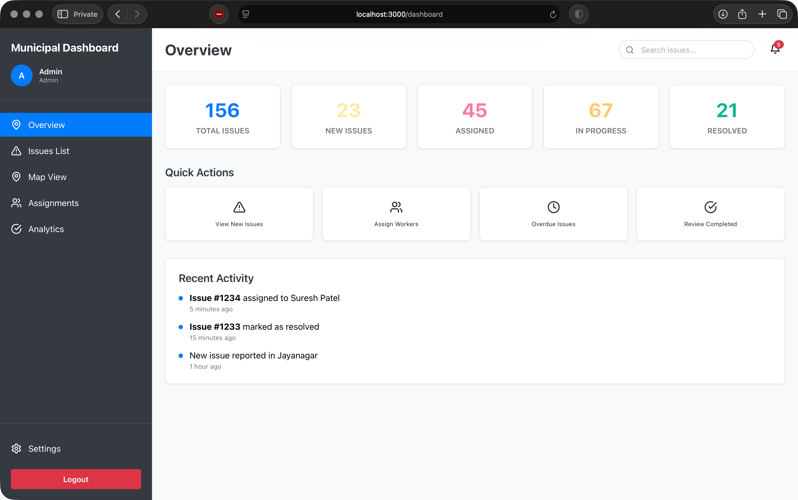

# Municipal Admin Web Dashboard

A comprehensive web dashboard for municipal staff to manage and resolve civic issue reports from citizens.

## Table of Contents

- [Screenshots](#screenshots)
- [Features](#features)
- [Technology Stack](#technology-stack)
- [Installation & Setup](#installation--setup)
- [Usage](#usage)
- [Data Structure](#data-structure)
- [Features by Role](#features-by-role)
- [Map Integration](#map-integration)
- [Development](#development)
- [Future Enhancements](#future-enhancements)

## Screenshots

The dashboard interface is comprehensively documented through screenshots in the `/docs/` directory. See [detailed screenshot documentation](docs/SCREENSHOTS.md) for complete descriptions.

### Login Page

*Secure role-based authentication with demo users for Admin, Supervisor, and Staff roles*

### Admin Dashboard Overview

*Main dashboard with real-time statistics, quick actions, recent activity timeline, and role-based navigation*

### Issues Management Interface

*Comprehensive issues list with advanced filtering, search capabilities, priority indicators, and status tracking*

### Worker Assignment System

*Worker management interface with performance metrics, specialties tracking, and assignment workflow*

> 📋 **Note**: For detailed explanations of each interface element and feature shown in these screenshots, refer to the [Screenshot Documentation](docs/SCREENSHOTS.md).

## Features

### Core Functionality
- **Role-Based Authentication**: Admin, Supervisor, and Staff roles with different permissions
- **Issue Management**: View, filter, and manage civic issues reported by citizens
- **Interactive Map**: Leaflet-based map showing all issues with real-time updates
- **Assignment Workflow**: Assign issues to workers with location and landmark information
- **Progress Monitoring**: Track issue status from report to resolution
- **Analytics Dashboard**: Comprehensive reports and performance metrics

### Key Components

#### 1. Login System
- Role-based access control (Admin, Supervisor, Staff)
- Demo users available for testing
- Secure authentication flow

#### 2. Dashboard Overview
- Real-time statistics and metrics
- Quick action buttons
- Recent activity timeline
- Issue status distribution

#### 3. Issues Management
- **List View**: Filterable and sortable issue list
- **Map View**: Interactive map with issue markers
- **Detail View**: Complete issue information with timeline
- **Status Updates**: Real-time status tracking
- **Comments System**: Communication between staff and citizens

#### 4. Worker Assignment
- Worker management and performance tracking
- Assignment workflow with automatic suggestions
- Worker availability and workload tracking
- Performance metrics and ratings

#### 5. Analytics & Reporting
- Issue trends and statistics
- Ward-wise performance analysis
- Worker performance metrics
- Category and priority distributions
- Monthly trend analysis

## Technology Stack

- **Frontend**: React 18 with functional components and hooks
- **Routing**: React Router DOM for navigation
- **Maps**: Leaflet with React-Leaflet for interactive mapping
- **Icons**: Lucide React for consistent iconography
- **Styling**: CSS-in-JS with React Native-inspired styling patterns
- **State Management**: React hooks (useState, useEffect)

## Installation & Setup

### Prerequisites
- Node.js (v14 or higher)
- npm or yarn package manager

### Installation
```bash
# Clone the repository
git clone <repository-url>
cd frontend

# Install dependencies
npm install

# Start the development server
npm start
```

The application will be available at `http://localhost:3000`

## Visual Interface Guide

The dashboard provides a comprehensive visual experience across multiple interfaces:

### 🔐 Authentication (`docs/login.png`)
- Clean, professional login interface with gradient background
- Role-based access with three user types (Admin, Supervisor, Staff)
- Demo user credentials prominently displayed for easy testing
- Responsive card-based layout with municipal branding

### 📊 Dashboard Overview (`docs/adminDashboard.png`)
- **Sidebar Navigation**: Role-based menu with user profile and settings
- **Statistics Cards**: Real-time metrics for total, new, assigned, in-progress, and resolved issues
- **Quick Actions**: Direct access to common administrative tasks
- **Activity Timeline**: Live updates on recent actions and assignments

### 📋 Issues Management (`docs/issuesPage.png`)
- **Advanced Filtering**: Multi-level filters by status, priority, category, and ward
- **Issue Cards**: Color-coded priority borders and status badges
- **Search Functionality**: Real-time search across all issue attributes
- **Action Buttons**: Context-sensitive actions based on user role and issue status

### 👥 Worker Assignment (`docs/assignments.png`)
- **Worker Profiles**: Complete information including specialties and performance metrics
- **Assignment Queue**: Unassigned issues ready for worker allocation
- **Performance Tracking**: Ratings, completion rates, and current workload
- **Smart Matching**: Skill and location-based assignment suggestions

For detailed feature explanations and UI element descriptions, see the [Screenshot Documentation](docs/SCREENSHOTS.md).

## Usage

### Demo Login
The application includes demo users for testing:

1. **Admin User**
   - Username: `admin`
   - Password: `demo123`
   - Role: `admin`
   - Full access to all features

2. **Supervisor User**
   - Username: `supervisor`
   - Password: `demo123`
   - Role: `supervisor`
   - Can manage assignments and view analytics

3. **Staff User**
   - Username: `staff`
   - Password: `demo123`
   - Role: `staff`
   - Limited to viewing and commenting on issues

### Navigation

- **Overview**: Dashboard with key metrics and quick actions
- **Issues List**: Comprehensive list of all issues with filtering
- **Map View**: Interactive map showing issue locations
- **Assignments**: Worker management and assignment (Admin/Supervisor only)
- **Analytics**: Reports and performance metrics (Admin/Supervisor only)

### Issue Management Workflow

1. **New Issues**: Reported by citizens via mobile app
2. **Verification**: Admin verifies and prioritizes issues
3. **Assignment**: Issues assigned to appropriate workers
4. **Progress Tracking**: Workers update status and upload photos
5. **Resolution**: Admin verifies completion and closes issues

## Styling System

The dashboard uses a React Native-inspired styling approach with JavaScript objects:

```javascript
const styles = {
  container: {
    flex: 1,
    backgroundColor: "#fff",
  },
  content: {
    flex: 1,
    padding: 20,
  },
  title: {
    textAlign: "center",
    marginBottom: 16,
  },
  // ... more styles
}
```

## Data Structure

### Issue Schema
```javascript
{
  id: number,
  title: string,
  description: string,
  category: string,
  status: 'new' | 'verified' | 'assigned' | 'in-progress' | 'resolved',
  priority: 'high' | 'medium' | 'low',
  location: {
    lat: number,
    lng: number,
    address: string,
    ward: string
  },
  reportedBy: string,
  reportedDate: ISO_DATE,
  assignedTo: string,
  timeline: array,
  images: array
}
```

## Features by Role

### Admin
- Full access to all features
- Issue verification and closure
- Worker assignment and management
- Analytics and reporting
- System configuration

### Supervisor
- Issue assignment and management
- Worker performance monitoring
- Analytics and reporting
- Limited system configuration

### Staff
- View assigned issues
- Update issue status
- Add comments and photos
- Basic issue information

## Map Integration

The dashboard uses OpenStreetMap with Leaflet for mapping functionality:

- **Interactive Markers**: Issues displayed with color-coded markers based on status
- **Priority Indicators**: Marker size indicates issue priority
- **Popup Information**: Click markers to view issue details
- **Filtering**: Real-time filtering of map markers
- **Auto-fitting**: Map automatically adjusts to show all visible issues

### Screenshot Reference Guide

The `/docs/` directory contains comprehensive visual documentation:

| Screenshot | File | Features Demonstrated |
|------------|------|-----------------------|
| **Login** | `docs/login.png` | Authentication, role selection, demo users |
| **Dashboard** | `docs/adminDashboard.png` | Statistics, navigation, quick actions, activity feed |
| **Issues** | `docs/issuesPage.png` | Filtering, search, status management, priority indicators |
| **Assignments** | `docs/assignments.png` | Worker profiles, performance metrics, assignment workflow |

Each screenshot demonstrates production-ready interfaces with complete functionality and professional design standards.

## Development

### Project Structure
```
frontend/
├── public/
│   └── index.html
├── src/
│   ├── components/
│   │   ├── Dashboard.js
│   │   ├── Login.js
│   │   ├── IssuesList.js
│   │   ├── IssuesMap.js
│   │   ├── Assignments.js
│   │   ├── Analytics.js
│   │   └── IssueDetail.js
│   ├── App.js
│   ├── App.css
│   ├── index.js
│   └── index.css
├── package.json
└── README.md
```

### Mock Data
The dashboard uses mock data for demonstration purposes. In a production environment, this would be replaced with actual API calls to a backend service.

### Responsive Design
The dashboard is designed to work on various screen sizes with responsive grid layouts and flexible components.

## Future Enhancements

- Real-time WebSocket integration for live updates
- Advanced analytics with charts and graphs
- Mobile app integration for field workers
- Document management and file uploads
- Multi-language support
- Advanced reporting and export features
- Integration with GIS systems
- Automated issue prioritization using AI

## Contributing

1. Fork the repository
2. Create a feature branch
3. Make your changes
4. Test thoroughly
5. Submit a pull request

## License

This project is licensed under the MIT License - see the LICENSE file for details.

## Support

For support and questions, please contact the development team or create an issue in the repository.